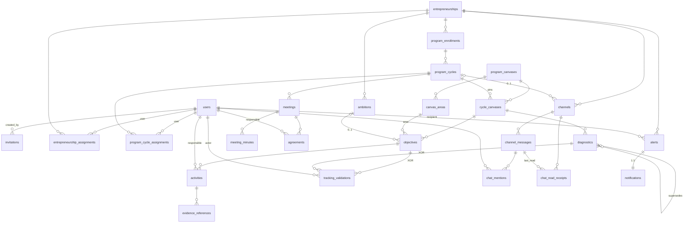
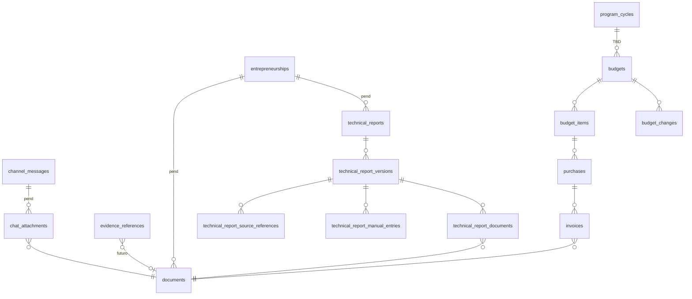

# Modelo de datos detallado (ER)

> **Estado — 2026-09-16.** Este documento cierra el [borrador de análisis](borrador-modelo-bd.md) (que quedó al 75 %) y lo lleva a un modelo entidad-relación completo y verificable. Complementa —no reemplaza— al [modelo conceptual compartido](modelo-de-datos-compartido.md) (vista de alto nivel) y conserva el borrador como notas históricas.
>
> **Regla de lectura:** para las áreas ya implementadas (identidad, expediente, seguimiento, comunicación, notificaciones/alertas, auditoría) la **fuente de verdad es el código** (`apps/api/app/models/*` + migraciones `001–004`); aquí se documenta lo que realmente existe y se señala qué campos del borrador **no** se implementaron. Para las áreas pendientes (finanzas, informes, archivos privados/R2, cola del worker) esto es **diseño propuesto** sujeto a los `TBD` de los documentos funcionales; no autoriza a implementar reglas que los programas aún no confirman.
>
> **Base:** rama `develop` (incluye la migración `004_comunicacion`, PR #6). `main` todavía no la tiene.
>
> Orden de autoridad en caso de conflicto (según `AGENTS.md`): decisiones del programa aplicable → [actores, roles y permisos](actores-roles-y-permisos.md) → [visión y alcance](vision-y-alcance.md) → historias de usuario.

## Leyenda de estado por tabla

- 🟢 **Implementado** — existe en modelos + migración; el modelo aquí describe la realidad.
- 🟡 **Diseño** — propuesto y coherente con los documentos, aún sin migración.
- 🔴 **Tentativo (TBD)** — depende de decisiones funcionales sin cerrar; se modela para no perder el hilo, no en firme.

---

## 1. Convenciones del modelo

Estas convenciones describen cómo está construido lo implementado y cómo debe extenderse lo nuevo, para que el modelo sea uniforme.

- **PostgreSQL único motor.** PK `id` tipo UUID en todas las tablas (en el código se almacena como `String(36)` con `uuid4()` para compatibilidad con la base de pruebas SQLite; en producción es PostgreSQL).
- **Ancla de alcance.** Toda tabla de negocio ancla en `entrepreneurship_id` (directo) o en un ciclo que resuelve a un emprendimiento (`program_cycle_id → program_enrollment → entrepreneurship`). **Regla dura e invariante: ninguna FK puede cruzar dos emprendimientos.** Se garantiza con **FK compuestas** que arrastran el `entrepreneurship_id`/`cycle_id` (patrón ya usado en seguimiento), no solo con validación de aplicación.
- **Marcas de tiempo.** `created_at` (con `timezone`) en toda tabla. `updated_at` **solo** en maestros mutables (`users`, `entrepreneurships`); las tablas históricas/append-only no lo llevan porque no se editan en sitio.
- **No-eliminación, implementada de tres formas** (no un `deleted_at` universal como asumía el borrador):
  1. **Inmutabilidad** de definiciones y registros aprobados (event listeners `before_update`/`before_delete` que lanzan error; p. ej. canvas, áreas, evidencias, validaciones, diagnóstico aprobado).
  2. **Revocación lógica** (`revoked_at`) donde la relación puede terminar sin desaparecer (asignaciones).
  3. **Versionado / superación** (`supersedes_id`, `revision`) donde un registro evoluciona conservando el anterior (diagnósticos, informes).
  4. **Revocación visual** en comunicación (`revoked_at`, reforzada por triggers que impiden el DELETE físico): un mensaje revocado se muestra con `content: null` pero conserva contenido y auditoría en base (ver §6).
- **Nomenclatura.** Tablas en `snake_case` y en plural (`objectives`, `program_cycles`). Entre paréntesis se cita la entidad del documento conceptual (`doc: ...`) para trazabilidad.
- **Enums como texto validado.** Roles, estados y tipos se guardan como `String` y se validan con `CheckConstraint` en base y/o conjuntos en la aplicación (p. ej. `VALID_ROLES`). Se evita `ENUM` nativo de PostgreSQL para poder ampliar valores (p. ej. añadir `RevisorFinanciero`) sin migración de tipo.
- **Concurrencia.** Escrituras sobre agregados usan **revisión optimista** (`revision` + `expected_revision`) y **bloqueo de fila** del ciclo para serializar; un cambio material reabre validaciones (`status → pending_validation`).

---

## 2. Decisiones cerradas (los 7 pendientes del borrador)

El borrador terminó con siete decisiones abiertas. Aquí se cierran; las que ya estaban decididas en código se marcan **RESUELTO EN CÓDIGO** y el resto como **DECISIÓN DE DISEÑO** o se mantienen **TBD** cuando el documento funcional aún no las define.

| # | Pendiente del borrador | Resolución |
|---|---|---|
| 1 | **EvolutionSnapshot vs. Diagnostic/Need/Ambition** | **RESUELTO EN CÓDIGO.** Ganó `Diagnostic`: es la fotografía comparable, con `assessments` (JSON, una entrada por área oficial), `assessed_on`, `status`, cadena de versiones `supersedes_id` e inmutabilidad al aprobar. `Ambition` es tabla aparte anclada al **emprendimiento**. El “Need” del prototipo **no** es tabla: vive como observación descriptiva dentro de `assessments`. **Sin escalas numéricas** (el prototipo no es fuente aprobada) → los puntajes siguen `TBD`; hoy la comparación es descriptiva. |
| 2 | **Grano emprendimiento vs. ciclo** | **RESUELTO (regla general).** Ancla por defecto en `entrepreneurship_id` (nunca cruza). Se añade `program_cycle_id` cuando la entidad vive dentro de un ciclo concreto. Ya aplicado: `Ambition` y las asignaciones de emprendimiento cuelgan del emprendimiento; `Objective`/`Activity`/`Evidence`/`Diagnostic`/`Validation` cuelgan del ciclo. Las tablas nuevas siguen esta regla según lo diga su documento de programa. |
| 3 | **Validation polimórfica o por tipo** | **RESUELTO EN CÓDIGO.** Semi-tipada: una tabla `tracking_validations` con FK tipadas `objective_id` **XOR** `diagnostic_id` (`CheckConstraint("(objective_id IS NULL) <> (diagnostic_id IS NULL)")`), más `snapshot` (JSON) y `entity_revision`. **No** es polimórfica pura `(entity_type, entity_id)`. Para validables futuros: se añade una FK tipada y se amplía el XOR, o el dominio lleva su propia traza de aprobación (finanzas e informes ya embeben `aprobado_por`). |
| 4 | **schedule_item tabla o vista** | **RESUELTO EN CÓDIGO.** **No es tabla.** El cronograma se **deriva** de `Activity` (`starts_on`, `ends_on`, `completed_at`). Si en el futuro se requieren hitos distintos de actividades, será una decisión nueva → `TBD`. |
| 5 | **Finanzas** | **TBD (se modela tentativo 🔴).** El documento financiero está lleno de `TBD` y solo Prototipado la habilita; la relación de Puesta en marcha con presupuesto sigue sin definir. Se propone estructura (§Finanzas) pero **no se implementa** hasta que el programa cierre partidas, flujo y estados. |
| 6 | **`document` unificado** | **DECISIÓN DE DISEÑO: sí, unificar.** Una tabla `documents` central para archivos privados en R2, referenciada por evidencia (binarios futuros), factura, adjunto de chat y PDF de informe. Evita repetir columnas de archivo y centraliza `storage_key` + emisión de URL firmada + auditoría. **Aún no implementada**: hoy la evidencia solo guarda URLs HTTP(S); `documents` entra con R2 (Fase 7). |
| 7 | **Rol RevisorFinanciero** | **TBD.** No está en `VALID_ROLES` (`Coordinadora`, `Gestor`, `Emprendedor`). Su alcance y separación respecto a Coordinadora/Gestor siguen sin definir en [roles](actores-roles-y-permisos.md). Como el rol es texto validado, añadirlo después **no** requiere migración de esquema, solo ampliar el conjunto/`CheckConstraint`. |

> Pendiente adicional heredado: **Pre-incubación** se dejó fuera del primer alcance; sus canvas, entregables y reglas se modelarán cuando el programa entre en juego. Todo lo `TBD` de programa permanece en sus documentos funcionales.

---

## 3. Identidad 🟢

Autenticación por **Google OAuth vía Clerk**; el rol y la autorización viven en PostgreSQL (Clerk **no** es fuente de verdad de permisos). La autorización se valida siempre en backend según rol × relación con el emprendimiento/ciclo.

### `users` (doc: User) 🟢
Identidad SIA.

| Columna | Tipo | Notas |
|---|---|---|
| `id` | UUID PK | |
| `clerk_user_id` | String(128), **único**, nullable | Se completa al primer acceso; nullable permite invitar antes de que exista la cuenta Clerk. |
| `email` | String(320), **único**, not null | Debe coincidir con el correo verificado de la invitación. |
| `role` | String(32), not null | `VALID_ROLES = {Coordinadora, Gestor, Emprendedor}`. `RevisorFinanciero` **TBD** (no incluido aún). |
| `created_at` / `updated_at` | timestamptz | Maestro mutable → lleva `updated_at`. |

- **Divergencia con el borrador:** no se implementaron `nombre` ni `estado` (activo/inactivo). Si se requieren, entran como campos nuevos → hoy `TBD`.

### `invitations` (doc: Invitation) 🟢
El primer acceso exige una invitación vigente, no usada y ligada al mismo correo verificado.

| Columna | Tipo | Notas |
|---|---|---|
| `id` | UUID PK | |
| `email` | String(320), not null, **index** | |
| `role` | String(32), not null | Rol que se otorgará al aceptar. |
| `token` | String(64), **único**, not null | |
| `created_by` | FK → `users.id`, nullable | Nullable para permitir el bootstrap de la primera Coordinadora. |
| `expires_at` | timestamptz, not null | |
| `used_at` | timestamptz, nullable | `null` = sin usar. |
| `created_at` | timestamptz | |

---

## 4. Expediente 🟢

El expediente es **único y persistente** por emprendimiento; pasar de un programa a otro no borra lo anterior. Este es el subárbol raíz del que cuelga casi todo el modelo.

### `entrepreneurships` (doc: Entrepreneurship) 🟢
Expediente único; raíz de alcance.

| Columna | Tipo | Notas |
|---|---|---|
| `id` | UUID PK | |
| `name` | String(200), not null | |
| `created_at` / `updated_at` | timestamptz | Maestro mutable. |

- **Divergencia con el borrador:** `estado` y `perfil` (campos obligatorios del perfil) **no** implementados → `TBD` en los documentos de programa.

### `program_enrollments` (doc: ProgramEnrollment) 🟢
Participación histórica en un programa. Un emprendimiento puede tener varias inscripciones a lo largo del tiempo.

| Columna | Tipo | Notas |
|---|---|---|
| `id` | UUID PK | |
| `entrepreneurship_id` | FK → `entrepreneurships.id`, not null, **index** | |
| `program` | String(64), not null | Valores: `pre_incubacion` \| `prototipado` \| `puesta_en_marcha`. |
| `enrolled_at` | timestamptz, not null | |

- **Divergencia con el borrador:** `estado`, `fecha_salida`, `motivo_salida` y las reglas de transición entre programas **no** implementados → `TBD` (criterios de salida por programa).

### `program_cycles` (doc: ProgramCycle) 🟢
Ciclo o proyecto concreto dentro de una inscripción (p. ej. un proyecto financiado de Prototipado).

| Columna | Tipo | Notas |
|---|---|---|
| `id` | UUID PK | |
| `enrollment_id` | FK → `program_enrollments.id`, not null, **index** | Resuelve el emprendimiento vía la inscripción. |
| `name` | String(200), not null | |
| `created_at` | timestamptz | |

- **Divergencia con el borrador:** `tipo` (`proyecto_financiado` \| `intervencion`), `estado` y `fecha_inicio`/`fecha_fin` **no** implementados → `TBD`.

### `entrepreneurship_assignments` (doc: relación N:M a nivel emprendimiento) 🟢
Liga usuarios (gestores/emprendedores) con el **emprendimiento** completo.

| Columna | Tipo | Notas |
|---|---|---|
| `id` | UUID PK | |
| `entrepreneurship_id` | FK → `entrepreneurships.id`, not null, **index** | |
| `user_id` | FK → `users.id`, not null, **index** | |
| `role` | String(32), not null | Relación (`Gestor` \| `Emprendedor`). |
| `revoked_at` | timestamptz, nullable | Revocación lógica; `null` = activa. |
| `created_at` | timestamptz | |

- **Índice único parcial** `uq_entrepreneurship_active_assignment` sobre `(entrepreneurship_id, user_id, role)` **WHERE `revoked_at IS NULL`**: evita duplicar una asignación activa, pero permite el historial de asignar → revocar → reasignar.

### `program_cycle_assignments` (doc: relación N:M a nivel ciclo) 🟢
Liga usuarios con un **ciclo** concreto. Una asignación a un ciclo **no** concede acceso a sus ciclos hermanos.

| Columna | Tipo | Notas |
|---|---|---|
| `id` | UUID PK | |
| `program_cycle_id` | FK → `program_cycles.id`, not null, **index** | |
| `user_id` | FK → `users.id`, not null, **index** | |
| `role` | String(32), not null | Relación (`Gestor` \| `Emprendedor`). |
| `revoked_at` | timestamptz, nullable | |
| `created_at` | timestamptz | |

- **Índice único parcial** `uq_cycle_active_assignment` sobre `(program_cycle_id, user_id, role)` **WHERE `revoked_at IS NULL`**.
- **Resuelve el pendiente #2 del borrador** (¿`cycle_id` nullable o dos tablas?): se optó por **dos tablas** separadas.

> **Autorización (no es tabla, es regla).** `Coordinadora` = acceso global (no requiere asignación). `Gestor`/`Emprendedor` acceden por asignación directa al emprendimiento **o** al ciclo exacto, con rol coincidente; las asignaciones revocadas dejan de autorizar. Toda lectura/escritura de seguimiento resuelve la cadena `cycle → enrollment → entrepreneurship`. Un `Gestor` no asigna ni remueve gestores (solo la Coordinadora). Matriz completa en [actores, roles y permisos](actores-roles-y-permisos.md).

---

## 5. Seguimiento 🟢

Canvas, plan de trabajo, evidencias, diagnóstico/evolución y validación. Todo el agregado cuelga del **ciclo** (`program_cycle_id`), salvo la ambición, que cuelga del **emprendimiento**. Trazabilidad: US-PRO-001/002/005/006 y US-PM-001/002 (ver [módulo de seguimiento](../../apps/api/app/modules/seguimiento/README.md)).

### Mixins compartidos (código)
Dos bases reutilizadas por las tablas de este módulo:

- **`Record`**: `id` (UUID PK) + `created_at` (timestamptz).
- **`Editable`** (extiende `Record`): añade `revision` (int, default 1, `>0`), `title` (String 200) y `description` (Text, default `""`). Habilita la **revisión optimista**.

### `program_canvases` (doc: ProgramCanvas) 🟢 · *inmutable*
Definición versionada del canvas por programa. La migración `003` siembra el **v1** de Prototipado y de Puesta en marcha.

| Columna | Tipo | Notas |
|---|---|---|
| `id` | UUID PK | |
| `program` | String(64), not null | `prototipado` \| `puesta_en_marcha` (Pre-incubación pendiente). |
| `version` | int, not null | `CheckConstraint("version > 0")`. |
| `created_at` | timestamptz | |

- **Unique** `(program, version)`. Registro de definición → **inmutable** (no update/delete).

### `canvas_areas` (doc: CanvasArea) 🟢 · *inmutable*
Cada área del canvas. Extensible por definición, pero fija una vez sembrada.

| Columna | Tipo | Notas |
|---|---|---|
| `id` | UUID PK | |
| `canvas_id` | FK → `program_canvases.id`, not null | |
| `key` | String(64), not null | Clave estable del área. |
| `name` | String(200), not null | |
| `description` | Text, not null | |
| `position` | int, not null | Orden de despliegue. |

- **Unique**: `(canvas_id, key)`, `(canvas_id, position)` y `(id, canvas_id)` (esta última habilita las FK compuestas que fijan área↔canvas). Inmutable.

### `cycle_canvases` (doc: CycleCanvas) 🟢
Fija (“pins”) la versión de canvas que usa un ciclo. Evita que un ciclo siga un “último” mutable: una vez fijado, su definición no cambia bajo sus pies.

| Columna | Tipo | Notas |
|---|---|---|
| `cycle_id` | FK → `program_cycles.id`, **PK** | |
| `canvas_id` | FK → `program_canvases.id`, not null | |
| `entrepreneurship_id` | FK → `entrepreneurships.id`, not null | Se arrastra para las FK compuestas de alcance. |

- **Unique** `(cycle_id, canvas_id, entrepreneurship_id)`. Un trigger SQL comprueba el vínculo canvas↔ciclo↔inscripción↔emprendimiento.

### `ambitions` (doc: Ambition) 🟢 · `Editable`
Aspiración del emprendimiento, **independiente del avance** y persistente entre programas. Cuelga del **emprendimiento**, no del ciclo (se consulta/edita desde cualquier ciclo autorizado del mismo emprendimiento).

| Columna | Tipo | Notas |
|---|---|---|
| `id` | UUID PK | |
| `entrepreneurship_id` | FK → `entrepreneurships.id`, not null, **index** | |
| `revision`, `title`, `description` | (de `Editable`) | |
| `created_at` | timestamptz | |

- **Unique** `(id, entrepreneurship_id)` → habilita la FK compuesta que impide que un objetivo vincule una ambición de **otro** emprendimiento. `before_delete` bloqueado (histórico).

### `objectives` (doc: Objective) 🟢 · `Editable`
Objetivo del plan, dentro de un área del canvas fijado al ciclo. Puede vincular **cero o una** ambición.

| Columna | Tipo | Notas |
|---|---|---|
| `id` | UUID PK | |
| `cycle_id` | String(36), not null, **index** | |
| `canvas_id` | String(36), not null | |
| `entrepreneurship_id` | String(36), not null | |
| `area_id` | String(36), not null | |
| `ambition_id` | String(36), nullable | Opcional (0 o 1 ambición). |
| `deliverable` | String(200), nullable | **Referencia textual de trabajo**, no catálogo oficial (entregables oficiales `TBD`). |
| `status` | String(32), default `draft` | `draft` \| `pending_validation` \| `approved` \| `correction_requested` \| `rejected`. |
| `revision`, `title`, `description` | (de `Editable`) | |

- **FK compuestas**: `(cycle_id, canvas_id, entrepreneurship_id)`→`cycle_canvases`; `(area_id, canvas_id)`→`canvas_areas`; `(ambition_id, entrepreneurship_id)`→`ambitions`. **Unique** `(id, cycle_id)`.
- **Reglas:** un cambio material reabre validación (`status → pending_validation`); un objetivo **sin actividades no puede aprobarse** como tema amplio completado. `before_delete` bloqueado.

### `activities` (doc: Activity) 🟢 · `Editable`
Ejecución concreta de un objetivo. Alimenta el cronograma derivado.

| Columna | Tipo | Notas |
|---|---|---|
| `id` | UUID PK | |
| `cycle_id` | FK → `program_cycles.id`, not null, **index** | |
| `objective_id` | String(36), not null, **index** | |
| `responsible_id` | FK → `users.id`, not null | Responsable autorizado. |
| `starts_on` / `ends_on` | Date, not null | `CheckConstraint("starts_on <= ends_on")`. |
| `completed_at` | timestamptz, nullable | Finalización **manual y reversible**; sin estados Kanban. |
| `revision`, `title`, `description` | (de `Editable`) | |

- **FK compuesta** `(objective_id, cycle_id)`→`objectives`. **Unique** `(id, cycle_id)`.
- **Regla:** modificar actividades, finalizar o agregar evidencia **incrementa la revisión del objetivo e invalida su aprobación**. Una escritura sin cambios no invalida ni audita. `before_delete` bloqueado.

### `evidence_references` (doc: Evidence) 🟢 · *append-only / inmutable*
Respaldo de una actividad. **Hoy solo referencias HTTP(S)**: sin subida ni descarga de binarios ni `storage_key`.

| Columna | Tipo | Notas |
|---|---|---|
| `id` | UUID PK | |
| `cycle_id` | FK → `program_cycles.id`, not null, **index** | |
| `activity_id` | String(36), not null, **index** | |
| `title` | String(200), not null | |
| `kind` | String(32), not null | `link` \| `file` \| `photograph` \| `video`. **Todos son enlace externo**, no archivo almacenado (límites MIME/tamaño y R2 `TBD`). |
| `url` | String(2048), not null | |
| `description` | Text, default `""` | |
| `created_by` | FK → `users.id`, not null | |

- **FK compuesta** `(activity_id, cycle_id)`→`activities`. Inmutable (no update/delete).
- **Nota de evolución (decisión #6):** cuando entren binarios/R2, `kind ∈ {file, photograph, video}` referenciará un `documents.id` en vez de `url`; hoy no.

### `diagnostics` (doc: Diagnostic / EvolutionSnapshot) 🟢 · *inmutable al aprobar*
La fotografía comparable del emprendimiento (US-PRO-005). **Resuelve el pendiente #1**: es el `EvolutionSnapshot` del doc, enriquecido con `assessments`.

| Columna | Tipo | Notas |
|---|---|---|
| `id` | UUID PK | |
| `cycle_id` | String(36), not null, **index** | |
| `canvas_id` | String(36), not null | |
| `entrepreneurship_id` | String(36), not null | |
| `revision` | int, default 1 | |
| `assessed_on` | Date, not null | |
| `assessments` | JSON, not null | Lista de observaciones **por área oficial** (las seis áreas). **Descriptivo, sin puntajes** (escalas numéricas `TBD`). |
| `supersedes_id` | String(36), nullable | Cadena de versiones; una nueva fotografía supera a la anterior sin borrarla. |
| `status` | String(32), default `draft` | Mismo enum que `objectives`. |
| `created_by` | FK → `users.id`, not null | |

- **FK compuestas**: `(cycle_id, canvas_id, entrepreneurship_id)`→`cycle_canvases`; `(supersedes_id, cycle_id)`→`diagnostics` (la precedente es del mismo ciclo).
- **Inmutable al aprobar**: `before_update` bloquea si el estado previo era `approved` (crear nueva fotografía en su lugar). `before_delete` bloqueado. Comparación solo entre **aprobadas** del mismo ciclo/canvas.

### `tracking_validations` (doc: Validation) 🟢 · *inmutable*
Registro de cada decisión de validación (US-PRO-002/US-PM-002). **Resuelve el pendiente #3**: semi-tipada, un objetivo **XOR** un diagnóstico.

| Columna | Tipo | Notas |
|---|---|---|
| `id` | UUID PK | |
| `cycle_id` | FK → `program_cycles.id`, not null, **index** | |
| `objective_id` | String(36), nullable, **index** | |
| `diagnostic_id` | String(36), nullable, **index** | |
| `actor_id` | FK → `users.id`, not null | Validador (Gestor asignado o Coordinadora). |
| `decision` | String(32), not null | `approve` \| `request_correction` \| `reject`. |
| `observation` | Text, not null | |
| `entity_revision` | int, not null | Revisión validada (detecta validaciones obsoletas). |
| `snapshot` | JSON, not null | Instantánea de objetivo/actividades/evidencias o del diagnóstico al validar. |

- **Checks**: `(objective_id IS NULL) <> (diagnostic_id IS NULL)` (exactamente uno); `decision IN (...)`. **FK compuestas** `(objective_id, cycle_id)` y `(diagnostic_id, cycle_id)`. Inmutable.

> **Cronograma (pendiente #4): no es tabla.** `GET /schedule` **deriva** el cronograma de `activities` (`starts_on`/`ends_on`/`completed_at`). No hay `schedule_item` materializado ni hitos separados (eso sería decisión nueva → `TBD`).

> **Transaccionalidad (código):** cada comando corre en una transacción única (entidad + reapertura + decisión + auditoría); cualquier fallo revierte todo. Bloqueo de fila del ciclo serializa las mutaciones del agregado; bloqueo adicional de la ambición compartida.

---

## 6. Comunicación 🟢

Reemplazo interno de Teams + registro de reuniones externas (Fase 4, migración `004`, PR #6). Detalle de reglas en el [módulo de comunicación](../../apps/api/app/modules/comunicacion/README.md). Trazabilidad: US-PRO-004 / US-PM-003 (minutas y acuerdos como fuentes del futuro informe) + reglas del núcleo (no hay historias numeradas de chat).

### Mixins de este módulo (código)
Definidos localmente en `comunicacion.py` (no comparte los de seguimiento):

- **`Record`**: `id` (UUID PK) + `created_at`.
- **`Editable`** (extiende `Record`): añade `created_by` (FK → `users.id`), `revision` (int, default 1) y **`revoked_at`** (nullable).

La no-eliminación de este módulo combina **revocación lógica** (`revoked_at`, oculta sin borrar) con **triggers SQL** que instala la migración `004` (en PostgreSQL vía funciones `communication_history_guard`/`communication_scope_guard`, y su equivalente en SQLite):

1. **Bloquean el DELETE físico** en las 9 tablas de comunicación.
2. **Congelan** por tabla las columnas de propiedad/alcance (`id`, `created_at`, `created_by`, las FK de scope; en minutas también `origin` y `source_transcript`): no se pueden reasignar tras crearse.
3. Hacen **inmutable** la minuta con `status = 'aprobada'` (cualquier UPDATE falla).
4. Un **`communication_scope_guard`** en `channels` y `alerts` (las dos tablas con `entrepreneurship_id` **y** `cycle_id`) verifica que el `cycle_id` pertenezca al `entrepreneurship_id`. Reuniones/minutas/acuerdos heredan el alcance por FK al ciclo/reunión, sin trigger propio.

### `meetings` (doc: Meeting) 🟢 · `Editable`
La reunión ocurre en Zoom/Meet; SIA guarda referencia y contexto (sin grabaciones). Cuelga del **ciclo**.

| Columna | Tipo | Notas |
|---|---|---|
| `id` | UUID PK | |
| `cycle_id` | FK → `program_cycles.id`, not null, **index** | Hereda emprendimiento vía `cycle → enrollment`. |
| `title` | String(200) | |
| `scheduled_at` | timestamptz | Fecha con zona horaria. |
| `participants` | JSON | Lista **descriptiva** de participantes (incluye externos); no son FK a `users`. |
| `reference_url` | Text, nullable | Enlace/referencia HTTP(S). |
| `created_by`, `revision`, `revoked_at`, `created_at` | (de `Editable`) | Reunión revocada: consultable, sin nuevos acuerdos/minutas. |

- **Resuelve la duda del borrador** sobre participantes: se guardan como **JSON descriptivo**, no tabla puente (permite externos sin cuenta).

### `meeting_minutes` (doc: MeetingMinutes) 🟢 · `Editable` · *aprobada = protegida*
Minuta manual o borrador desde transcripción. Toda minuta IA exige revisión humana antes de publicar.

| Columna | Tipo | Notas |
|---|---|---|
| `id` | UUID PK | |
| `meeting_id` | FK → `meetings.id`, not null, **index** | |
| `content` | Text | |
| `origin` | String(20) | `CheckConstraint` `manual` \| `ia_borrador`. |
| `source_transcript` | Text, nullable | **Obligatorio si `origin = ia_borrador`** (`ck_minutes_source`). |
| `status` | String(20), default `borrador` | `borrador` \| `aprobada`. |
| `reviewed_by` | FK → `users.id`, nullable | |
| `approved_at` | timestamptz, nullable | |
| `created_by`, `revision`, `revoked_at`, `created_at` | (de `Editable`) | |

- **Check clave `ck_minutes_review`**: `status='aprobada'` **exige** `reviewed_by IS NOT NULL AND approved_at IS NOT NULL AND revoked_at IS NULL`. La revisión humana no es opcional en base de datos. Una corrección de una minuta aprobada se registra como **otra** minuta, sin sobrescribir.

### `agreements` (doc: Agreement) 🟢 · `Editable`
Acuerdo que sale de la reunión, con responsable, fecha y próximos pasos.

| Columna | Tipo | Notas |
|---|---|---|
| `id` | UUID PK | |
| `meeting_id` | FK → `meetings.id`, not null, **index** | |
| `description` | Text | |
| `responsible_id` | FK → `users.id` | Responsable autorizado. |
| `due_date` | Date | |
| `next_steps` | Text | |
| `created_by`, `revision`, `revoked_at`, `created_at` | (de `Editable`) | |

- **Resuelve el pendiente del borrador `meeting_action` vs `agreement`**: se **fusionaron**. No existe tabla `MeetingAction`; los próximos pasos son el campo `next_steps` del acuerdo (sin automatizar actividades). Estados de acuerdo → `TBD`.

### `channels` (doc: Channel) 🟢 · `Editable`
Canal del emprendimiento y, opcionalmente, de un ciclo exacto.

| Columna | Tipo | Notas |
|---|---|---|
| `id` | UUID PK | |
| `entrepreneurship_id` | FK → `entrepreneurships.id`, not null, **index** | |
| `cycle_id` | FK → `program_cycles.id`, nullable, **index** | `null` = canal compartido del emprendimiento. |
| `name` | String(200) | |
| `created_by`, `revision`, `revoked_at`, `created_at` | (de `Editable`) | |

- **Divergencia con el borrador:** **no** hay columna `tipo` (`reuniones`/`finanzas`/`general`). La **taxonomía y permisos por tipo siguen `TBD`**; hoy el canal es solo `name`, sin categorías predefinidas ni siembra automática. Aplica la regla #2 (ancla emprendimiento + ciclo opcional).

### `channel_messages` (doc: ChannelMessage) 🟢 · `Editable` · *borrado visual*
Mensaje de chat.

| Columna | Tipo | Notas |
|---|---|---|
| `id` | UUID PK | |
| `channel_id` | FK → `channels.id`, not null, **index** | |
| `content` | Text | |
| `created_by`, `revision`, `revoked_at`, `created_at` | (de `Editable`) | |

- **Unique** `(id, channel_id)` → habilita la FK compuesta del acuse de lectura. **Borrado visual**: un mensaje revocado (`revoked_at`) se devuelve como marcador con `content: null`; el contenido anterior **permanece en DB y auditoría**. Editar/revocar limitado al **autor** (sin moderación de mensajes ajenos).

### `chat_mentions` (doc: ChatMention) 🟢
Menciones, que disparan alerta + notificación.

| Columna | Tipo | Notas |
|---|---|---|
| `id` | UUID PK | |
| `message_id` | FK → `channel_messages.id`, not null, **index** | |
| `user_id` | FK → `users.id`, not null, **index** | Debe tener acceso actual al canal (si no, 422). |

- **Unique** `(message_id, user_id)`: una mención repetida en el mismo mensaje = **una** fila/alerta/notificación. Se fijan al crear el mensaje; **no** se parsean del texto `@...`.

### `chat_read_receipts` (doc: ChatReadReceipt) 🟢
Acuse de lectura por usuario/canal; base de los "no leídos".

| Columna | Tipo | Notas |
|---|---|---|
| `id` | UUID PK | |
| `channel_id` | FK → `channels.id`, not null, **index** | |
| `user_id` | FK → `users.id`, not null | |
| `last_read_message_id` | String(36) | |
| `read_at` | timestamptz | Avanza sin retroceder. |

- **Unique** `(channel_id, user_id)`. **FK compuesta** `(last_read_message_id, channel_id)` → `channel_messages`: impide marcar como leído un mensaje de **otro** canal. "No leídos" excluye mensajes propios y revocados.

### `chat_attachments` (doc: ChatAttachment) 🟡 *pendiente*
**No implementada.** Los adjuntos privados (MIME/tamaño, subida) están declarados como integración **no configurada** (stub que falla explícito). Entrará junto con `documents`/R2 (decisión #6, Fase 7): `chat_attachments(id, message_id → channel_messages, document_id → documents, ...)`. Hoy no hay subida de archivos en chat.

---

## 7. Notificaciones y alertas 🟢

Separadas a propósito: la **alerta** es el evento de negocio para un destinatario; la **notificación** es su entrega interna. Registran tipo, emprendimiento/ciclo, destinatario, fecha y lectura/resolución. Periodicidad, escalamiento y cierre → `TBD` (no hay programador ni endpoint público de resolución).

### `alerts` (doc: Alert) 🟢
Evento pendiente para un destinatario, dentro de su alcance. Hoy la emite el flujo de menciones vía `emit_alert` (entrada interna transaccional, no endpoint público).

| Columna | Tipo | Notas |
|---|---|---|
| `id` | UUID PK | |
| `entrepreneurship_id` | FK → `entrepreneurships.id`, not null, **index** | |
| `cycle_id` | FK → `program_cycles.id`, nullable, **index** | |
| `recipient_id` | FK → `users.id`, not null, **index** | |
| `kind` | String(40) | Tipo del evento (seguimiento, validación, acuerdo, mención…). |
| `detail` | Text | |
| `source_key` | String(200), **único** | **Idempotencia**: el mismo evento no genera alertas duplicadas. |
| `resolved_at` | timestamptz, nullable | |

### `notifications` (doc: Notification) 🟢
Entrega interna de una alerta. Destinatario y alcance **se heredan de la alerta**, nunca se escriben aparte.

| Columna | Tipo | Notas |
|---|---|---|
| `id` | UUID PK | |
| `alert_id` | FK → `alerts.id`, **único** | 1:1 con la alerta. |
| `read_at` | timestamptz, nullable | Lectura idempotente. |

- **Divergencia con el borrador:** no hay columnas `user_id`/`tipo`/`canal`/`sent_at` propias — se derivan de `alert`. El **correo (Resend)** aún no se entrega: la integración está como stub no configurado → la notificación hoy es solo **in-app**. Bandejas filtran destinatario y asignaciones vigentes antes de paginar; la Coordinadora **no** lee bandejas personales ajenas.

---

## 8. Transversales e infraestructura

### `audit_logs` (doc: AuditLog) 🟢
Rastro de toda acción sensible. Lo escriben los servicios en la **misma transacción** que la mutación (nunca queda una acción sin su auditoría).

| Columna | Tipo | Notas |
|---|---|---|
| `id` | UUID PK | |
| `actor_id` | String(36), nullable | Nullable para acciones de sistema/bootstrap. No es FK dura (conserva el rastro aunque el usuario cambie). |
| `action` | String(64), not null | |
| `entity_type` | String(64), not null | |
| `entity_id` | String(64), not null | |
| `before` | JSON, nullable | Estado anterior. |
| `after` | JSON, nullable | Estado posterior. |
| `created_at` | timestamptz | |

- Registra al menos: aprobaciones, cambios de objetivos aprobados, movimientos de presupuesto, validaciones, cierres, mensajes editados/eliminados y emisión de informes. Sin índice de scope por diseño (es transversal); las consultas van por `entity_type`/`entity_id`/`actor_id`.

### `documents` (transversal — decisión de diseño #6) 🟡 *pendiente (R2, Fase 7)*
Tabla central de archivos privados en R2. **Decisión de diseño (no está en el doc explícito):** unificar en vez de repetir columnas de archivo en evidencia, factura, adjunto e informe.

| Columna | Tipo | Notas |
|---|---|---|
| `id` | UUID PK | |
| `entrepreneurship_id` | FK → `entrepreneurships.id`, not null, **index** | Ancla de alcance; **nunca cruza** emprendimientos. |
| `storage_key` | String | Clave del objeto en R2. |
| `name` | String(200) | |
| `mime` | String | Límites MIME/tamaño `TBD`. |
| `size` | int | |
| `uploaded_by` | FK → `users.id` | |
| `created_at` | timestamptz | |

- **Referenciada por:** `evidence_references` (cuando `kind ∈ {file, photograph, video}` deje de ser URL), `chat_attachments`, `invoices`, `technical_report_documents`. La emisión de **URL firmada** la hace la API. Hoy no existe: la evidencia solo guarda URLs HTTP(S).

### `job_queue` (infra — worker) 🟡 *pendiente*
Cola persistente en PostgreSQL (decidido: PostgreSQL como cola, sin Redis en MVP). Aquí viven las tareas del worker (minutas IA, correo Resend, alertas, PDF), **idempotentes**.

| Columna | Tipo | Notas |
|---|---|---|
| `id` | UUID PK | |
| `kind` | String | Tipo de tarea. |
| `payload` | JSON | |
| `status` | String | |
| `attempts` | int | |
| `run_at` | timestamptz | Programación. |
| `locked_at` | timestamptz, nullable | |
| `idempotency_key` | String, **único** | Evita ejecutar dos veces. |

- Reclamo atómico con `FOR UPDATE SKIP LOCKED` → N workers horizontales. **No implementada** (el worker es esqueleto). Costuras ya existentes donde conectará: `emit_alert` (idempotente por `source_key`) y la interfaz `MinutesGenerator` del módulo de comunicación. Vive idealmente en su propio esquema (infra, no dominio).

---

## 9. Finanzas por programa 🔴 *tentativo — casi todo TBD*

> **Aviso fuerte:** es la parte más verde. Solo **Prototipado** habilita finanzas; **Puesta en marcha** aún **no define** su relación con presupuesto ([doc](../03-puesta-en-marcha/presupuesto-compras-y-facturas.md)). La **lista oficial de partidas, el flujo exacto de compras, los estados, los responsables y la integración administrativa** están `TBD`. Se modela para no perder el hilo; **no se implementa** hasta que el programa lo cierre. **La IA nunca aprueba** compras ni cambios presupuestarios.

Regla de cálculo (decisión sostenida del borrador): **`ejecutado`, `disponible` y `% consumido` NO se guardan**; se **calculan** desde compras y facturas. Todo cuelga del **ciclo** (`program_cycle_id`).

| Tabla (doc) | Columnas propuestas | TBD principal |
|---|---|---|
| `budgets` (presupuesto) 🔴 | `id`, `program_cycle_id` FK, `status`, `currency`, `total` | Estados y moneda `TBD`. |
| `budget_items` (partida) 🔴 | `id`, `budget_id` FK, `name`, `amount_allocated` | **Catálogo oficial de partidas `TBD`.** |
| `purchases` (compra) 🔴 | `id`, `budget_item_id` FK, `description`, `amount`, `status`, `requested_by` FK, `created_at` | Flujo solicitud→cotización→revisión→factura→pago, estados y responsables `TBD`. |
| `invoices` (factura) 🔴 | `id`, `purchase_id` FK, `number`, `amount`, `date`, `document_id` FK→`documents`, `payment_status` | Evitar carga duplicada; **integración administrativa `TBD`** (viabilidad incierta). |
| `budget_changes` (cambio presup.) 🔴 | `id`, `budget_id` FK, `kind`, `amount`, `source_item_id`, `target_item_id`, `requested_by` FK, `approved_by` FK, `status`, `created_at` | Reglas para mover fondos `TBD`. Requiere revisión/aprobación humana. |

- Depende del rol **RevisorFinanciero** (decisión #7, `TBD`). Permisos financieros detallados se definen por programa.

---

## 10. Informes técnicos 🟡 *estructura clara, plantilla TBD*

Informe periódico (arranca mensual) que **reutiliza datos del periodo** (objetivos, actividades completadas, evidencias, minutas, acuerdos, avances financieros). Clave: **la versión aprobada es una instantánea inmutable**; una corrección crea una versión nueva vinculada sin tocar la aprobada. Solo **Gestor asignado o Coordinadora** envía/revisa/aprueba. El PDF se genera **después** de aprobar (por el worker) y se guarda privado. Plantilla y campos obligatorios `TBD` ([ia-e-informes](ia-e-informes.md)).

### `technical_reports` (doc: TechnicalReport) 🟡
Contenedor del informe.

| Columna | Tipo | Notas |
|---|---|---|
| `id` | UUID PK | |
| `entrepreneurship_id` | FK → `entrepreneurships.id`, not null, **index** | |
| `program_cycle_id` | FK → `program_cycles.id`, nullable | "Ciclo cuando aplique". |
| `period_start` / `period_end` | Date | |
| `type` | String | `seguimiento` \| `cierre`. |

### `technical_report_versions` (doc: TechnicalReportVersion) 🟡 · *aprobada = inmutable*
| Columna | Tipo | Notas |
|---|---|---|
| `id` | UUID PK | |
| `technical_report_id` | FK → `technical_reports.id` | |
| `version` | int | |
| `status` | String | `borrador` \| `aprobado`. |
| `author` | FK → `users.id` | |
| `approved_by` | FK → `users.id`, nullable | |
| `approved_at` | timestamptz, nullable | |
| `supersedes_version_id` | FK → self, nullable | Corrección → versión nueva vinculada. |

### `technical_report_source_references` (doc: TechnicalReportSourceReference) 🟡
Trazabilidad obligatoria: cada contenido apunta a su fuente real (regla de IA: no inventar; faltante = "Pendiente de completar").

| Columna | Tipo | Notas |
|---|---|---|
| `id` | UUID PK | |
| `version_id` | FK → `technical_report_versions.id` | |
| `entity_type` | String | objetivo \| actividad \| evidencia \| minuta \| acuerdo \| dato financiero. |
| `entity_id` | String(36) | |
| `description` | Text | |

### `technical_report_manual_entries` (doc: TechnicalReportManualEntry) 🟡
| Columna | Tipo | Notas |
|---|---|---|
| `id` | UUID PK | |
| `version_id` | FK → `technical_report_versions.id` | |
| `section` | String | Campos por plantilla `TBD`. |
| `content` | Text | Faltante → "Pendiente de completar". |
| `author` | FK → `users.id` | |

### `technical_report_documents` (doc: TechnicalReportDocument) 🟡
| Columna | Tipo | Notas |
|---|---|---|
| `id` | UUID PK | |
| `version_id` | FK → `technical_report_versions.id` | |
| `document_id` | FK → `documents.id` | PDF privado. |
| `generated_at` | timestamptz | Posterior a la aprobación. |

---
## 11. Diagrama ER

Dos vistas para separar lo real de lo propuesto. Cardinalidad Mermaid: `||` = uno, `o{` = cero-o-muchos, `|o` = cero-o-uno.

### 11.1 Implementado 🟢 (migraciones 001–004)

> `audit_logs` es transversal y **no** lleva FK duras (`entity_type`/`entity_id`/`actor_id` sueltos), por eso va fuera del grafo.

### 11.2 Propuesto 🟡🔴 (sin migración)

> `job_queue` es infraestructura (esquema propio), sin FK de dominio; alimenta minutas IA, correo, alertas y PDF.

---

## 12. Índices y alcance (resumen operativo)

- **Columna de alcance primero.** Los índices de tablas de negocio empiezan por su columna de scope (`entrepreneurship_id` o `cycle_id`), ya presente en el código de identidad/expediente/seguimiento/comunicación.
- **FK compuestas que arrastran el scope** (garantía dura de "no cruzar emprendimientos"): objetivo/actividad/evidencia/diagnóstico por `cycle_id`; ambición por `entrepreneurship_id`; acuse de lectura por `channel_id`; canvas por `(cycle_id, canvas_id, entrepreneurship_id)`.
- **Únicos parciales** (`WHERE ... IS NULL`) para relaciones revocables: asignaciones activas (`revoked_at IS NULL`).
- **Únicos de idempotencia:** `alerts.source_key`, `notifications.alert_id` (1:1), `chat_mentions (message_id, user_id)`, `job_queue.idempotency_key` (propuesto).
- **Paginación:** hoy `limit/offset` (comunicación: `limit=50`, máx 100). Keyset por scope queda como extensión si aparece volumen (principio 10 del plan).

---

## 13. Checklist de cierre del borrador

Estado final de los 7 pendientes que dejaste abiertos:

| # | Pendiente | Estado | Cómo quedó |
|---|---|---|---|
| 1 | EvolutionSnapshot vs. prototipo | ✅ Cerrado | `diagnostics` con `assessments` JSON + `supersedes_id`, inmutable al aprobar. Escalas numéricas siguen `TBD`. |
| 2 | Grano emprendimiento vs. ciclo | ✅ Cerrado | Regla: ancla `entrepreneurship_id`; `program_cycle_id` cuando aplica. Ya consistente en todo el árbol. |
| 3 | Validation polimórfica/por tipo | ✅ Cerrado | Semi-tipada (`objective_id` XOR `diagnostic_id`). |
| 4 | schedule_item tabla/vista | ✅ Cerrado | Derivado de `activities`; sin tabla. |
| 5 | Finanzas | 🔴 Diseño tentativo | Modelado con banderas; **no implementar** hasta que el programa cierre partidas/flujo/estados. |
| 6 | `documents` unificado | ✅ Decisión: sí | Tabla central R2; pendiente de implementación (Fase 7). |
| 7 | Rol RevisorFinanciero | 🔴 TBD | `role` es texto validado → añadirlo luego sin migración de esquema. |

Extra del borrador ya resuelto en código: **`meeting_action` no existe** (fusionado en `agreements.next_steps`); **participantes** de reunión = JSON descriptivo; **taxonomía de `channels`** sigue `TBD` (sin columna `tipo`).

### Bloqueadores que dependen de decisión funcional (no de modelado)
Estos `TBD` los deben cerrar los documentos de programa, no el modelo:
1. Catálogo oficial de **entregables** (obligatoriedad, evidencia mínima) y criterios de salida/transiciones entre programas.
2. **Finanzas** completas: partidas oficiales, flujo de compras/estados, integración administrativa.
3. **Rol RevisorFinanciero** y su alcance.
4. **Plantilla y campos** del informe mensual.
5. **Taxonomía y permisos** por tipo de canal.
6. Campos de perfil/estado de `entrepreneurships`, y estados/fechas de `program_enrollments`/`program_cycles`.
7. **Pre-incubación** completa (fuera del primer alcance).

### Pendiente de implementación (modelo listo, falta migración)
`documents` + `chat_attachments`, `job_queue`, e informes (`technical_reports` y familia) — dependen de R2/worker (Fases 5 y 7). Finanzas espera además el cierre funcional.

> Con esto el borrador queda cerrado al 100 % en lo que depende de modelado. Lo que sigue `TBD` está explícitamente delegado a los documentos funcionales, conforme a `AGENTS.md` (no inventar requerimientos).
