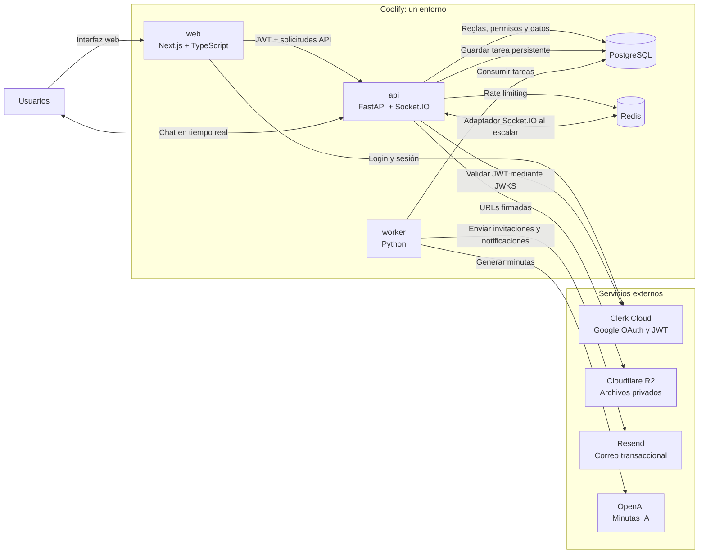

# Arquitectura de SIA

Este documento describe la arquitectura objetivo del MVP. El mismo conjunto de servicios se despliega de forma independiente en staging y producción.

## Diagrama general

## Responsabilidades

| Componente | Responsabilidad |
|---|---|
| `web` | Renderiza la interfaz de Next.js, integra Clerk en cliente y consume la API de FastAPI. No aplica reglas de autorización definitivas. |
| `api` | Valida JWT de Clerk, aplica autorización y reglas de negocio, expone la API, sirve Socket.IO y crea tareas persistentes. |
| `worker` | Procesa tareas asíncronas y reintentos: correo, notificaciones y minutas IA. |
| PostgreSQL | Fuente de verdad para usuarios de SIA, invitaciones, permisos, proyectos, chat, auditoría y tareas persistentes. |
| Redis | Rate limiting distribuido y coordinación Socket.IO cuando exista más de una instancia de API. No almacena datos de negocio. |
| Clerk | Gestiona identidad, Google OAuth, sesiones y JWT. No gestiona roles ni permisos de SIA. |
| R2 | Almacena archivos privados y entrega acceso mediante URLs firmadas autorizadas por FastAPI. |
| Resend | Envía invitaciones y notificaciones de correo iniciadas por el worker. |
| OpenAI | Genera minutas a partir de transcripciones suministradas por la plataforma. |

## Flujos críticos

### Autenticación y autorización

1. La persona inicia sesión con Google mediante Clerk.
2. Next.js obtiene la sesión y el JWT de Clerk.
3. Next.js envía el JWT a FastAPI.
4. FastAPI valida firma, emisor, audiencia y vigencia del token.
5. FastAPI consulta PostgreSQL para validar invitación activada, rol y relación con el proyecto.
6. Solo entonces ejecuta la acción solicitada.

### Chat

1. El cliente se conecta a Socket.IO con un JWT de Clerk.
2. FastAPI valida identidad y pertenencia al proyecto antes de agregar a la sala del proyecto.
3. FastAPI persiste el mensaje y sus referencias de adjuntos en PostgreSQL.
4. FastAPI emite el evento a la sala del proyecto.
5. Redis distribuye el evento entre instancias API si existe escalamiento horizontal.
6. El worker procesa notificaciones internas y por correo derivadas del mensaje.

### Tareas asíncronas

1. FastAPI guarda la operación de negocio y su tarea asociada en PostgreSQL.
2. El worker reclama la tarea con bloqueos seguros.
3. El worker llama a Resend u OpenAI.
4. El resultado, error y reintentos quedan registrados en PostgreSQL.

## Entornos

| Entorno | Rama | Servicios Coolify |
|---|---|---|
| Local | Ramas de trabajo | `web`, `api`, `worker`, `postgres`, `redis`, `minio`, `mailpit`. |
| Staging | `develop` | `web`, `api`, `worker`, `postgres`, `redis`. |
| Producción | `main` | `web`, `api`, `worker`, `postgres`, `redis`. |

Staging y producción usan PostgreSQL, Redis, configuración Clerk, bucket/prefijo R2 y credenciales de proveedores separados.
